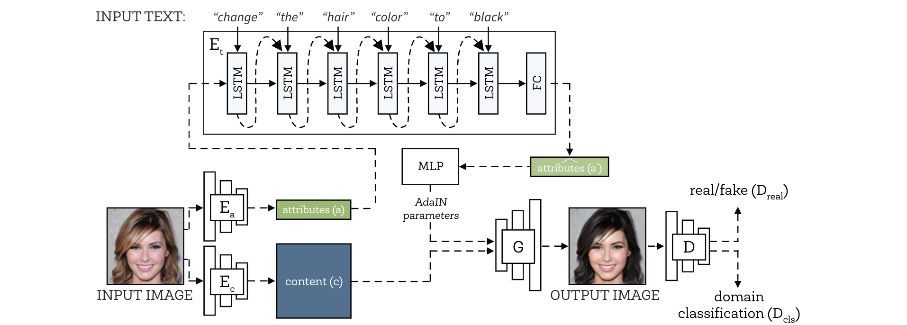

## Unsupervised Text-Guided Image Manipulation

This is the github repository for the project "Unsupervised Text-Guided Image Manipulation". We adopt [[DWC-GAN]] (https://dl.acm.org/doi/pdf/10.1145/3394171.3413505) as our baseline and propose multiple extensions to this architecture. 

## DWC-GAN

Describe What to Change: A Text-guided Unsupervised Image-to-Image Translation Approach, accepted to ACM International Conference on Multimedia(**ACM MM**), 2020. [[Paper]](https://dl.acm.org/doi/pdf/10.1145/3394171.3413505)|[[arXiv]](https://arxiv.org/abs/2008.04200)|[[code]](https://github.com/yhlleo/DWC-GAN)




4 models were developed: 
1. DWC-GAN-BERT (DWC-GAN + Bidirectional Text Representations)
2. DWC-GAN-Attention (DWC-GAN + Two-sided Attention)
3. DWC-GAN-VAE (DWC-GAN + VAE with skip connections)
4. DWC-GAN-VAE-noskip (DWC-GAN + VAE without skip connections)
5. DWC-GAN-VAE-simple (DWC-GAN + simplified VAE)


### Configuration

See the [`environment.yaml`](./environment.yaml). The requirements are the same as DWC-GAN. Additionally we installed libraries like Weights&Biases to log all our experiments.

```
conda env create -f environment.yaml
```

### CelebA faces

 - Official homepage of dataset: [link](http://mmlab.ie.cuhk.edu.hk/projects/CelebA.html) 
 - Prepare the dataset as the bellow structure:

```
datasets
  |__celeba
       |__images
       |    |__xxx.jpg
       |    |__...
       |__list_attr_celeba.txt
```


### Training 

 - Train:

```
sh ./scripts/train_celeba_faces.sh <gpu_id> 0
```

### Evaluation codes

We evaluate the performances of the compared models mainly based on this repo: [GAN-Metrics](https://github.com/yhlleo/GAN-Metrics)


### References

DWC-GAN

```
@inproceedings{liu2020describe,
  title={Describe What to Change: A Text-guided Unsupervised Image-to-Image Translation Approach},
  author={Liu, Yahui and De Nadai, Marco and Cai, Deng and Li, Huayang and Alameda-Pineda, Xavier and Sebe, Nicu and Lepri, Bruno},
  booktitle={Proceedings of the 28th ACM International Conference on Multimedia},
  year={2020}
}
```


The readme was developed thanks to this [[repository]](https://github.com/namratadeka/scene-rearrangement/blob/main/README.md)
